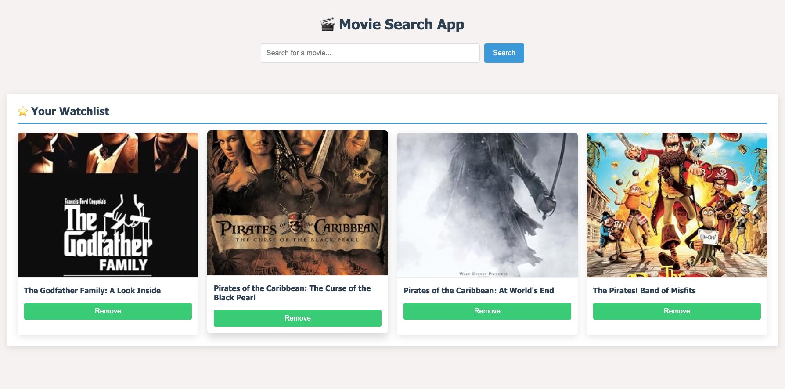

# 🎬 Bookmark your favorite Movies

A responsive web app that will allow users to search for movies using the APIs, and save favorites to a later watching list.



## ✨ Features

- **2x External API**:
  - OMDb API for basic movie information
  - TMDb API for ratings and popularity data
- **Interactive Watchlist**:
  - Add/remove movies with localStorage
- **Modern UI**:
  - Responsive grid layout
  - Smooth animations and transitions

## 🛠 Technologies Used

- **Frontend**:
  - JavaScript
  - HTML
  - CSS
- **My APIs**:
  - [OMDb API](http://www.omdbapi.com/)
  - [TMDb API](https://www.themoviedb.org/)

## 📦 Installation

1. Clone the repository:
   ```bash
   https://github.com/fransdube/movieapp.git
   cd movieapp
   
Please get some free API keys:

Register for a free OMDb API key
Register for a free TMDb API key

Add your API keys to api.js:

javascript
const OMDb_API_KEY = "your_omdb_key_here";
const TMDb_API_KEY = "your_tmdb_key_here";

Open index.html in your browser (no server required)

🚀 Usage

Enter a movie title in the search box

Browse results with ratings from TMDb

Click "Add to Watchlist" to save favorites

View/remove items from your watchlist


Planned Future Enhancements

    Implement a "More Info" modal with detailed movie data

    Add sorting/filtering options

    Dark mode toggle

    User ratings/reviews system


    I acknowledge for the FREE APIs
    OMDb and TMDb for their excellent APIs
